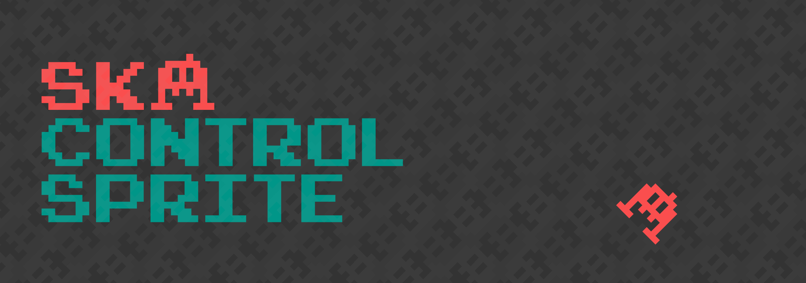

SKAControlSprite is a simple SKSpriteNode class that mimics the usefulness of UIControl. Use it to create buttons, sliders, checkboxes, joysticks and other custom controls for your games. SKAControlSprite is in the SKAToolKit family created by the Sprite Kit Alliance to be used with Apple's Sprite Kit framework.  

The Sprite Kit Alliance is happy to provide the SKAControlSprite, SKAToolKit, and example uses free of charge without any warranty or guarantee (see license below for more info). If there is a feature missing or you would like added please email us at join@spritekitalliance.com

[](http://cocoadocs.org/docsets/SKAButton)
[](https://github.com/SpriteKitAlliance/SKAButton/blob/master/LICENSE)
[](http://twitter.com/SKADevs)

## SKControlSprite Install Instructions

### Using Cocoapods
```ogdl
pod 'SKAControlSprite''~> 1.0'
```

## Useful Methods
    //Add target to a control
    button.addTarget(self, selector: #selector(buttonClicked(_:)), forControlEvents: .TouchUpInside)
    
    //Add target for multiple events
    button.addTarget(self, selector: #selector(multipleEvents(_:)), forControlEvents: [.TouchUpInside, .TouchUpOutside])

    //Check value changes
    slider.addTarget(self, selector: #selector(sliderUpdated(_:)), forControlEvents: .ValueChanged)


        
## Contact Info
If you would like to get in contact with the SKA, email us at join@spritekitalliance.com
    
## License
Copyright (c) 2017 Sprite Kit Alliance

Permission is hereby granted, free of charge, to any person obtaining a copy of this software and associated documentation files (the "Software"), to deal in the Software without restriction, including without limitation the rights to use, copy, modify, merge, publish, distribute, sublicense, and/or sell copies of the Software, and to permit persons to whom the Software is furnished to do so, subject to the following conditions:

The above copyright notice and this permission notice shall be included in all copies or substantial portions of the Software.

THE SOFTWARE IS PROVIDED "AS IS", WITHOUT WARRANTY OF ANY KIND, EXPRESS OR IMPLIED, INCLUDING BUT NOT LIMITED TO THE WARRANTIES OF MERCHANTABILITY, FITNESS FOR A PARTICULAR PURPOSE AND NONINFRINGEMENT. IN NO EVENT SHALL THE AUTHORS OR COPYRIGHT HOLDERS BE LIABLE FOR ANY CLAIM, DAMAGES OR OTHER LIABILITY, WHETHER IN AN ACTION OF CONTRACT, TORT OR OTHERWISE, ARISING FROM, OUT OF OR IN CONNECTION WITH THE SOFTWARE OR THE USE OR OTHER DEALINGS IN THE SOFTWARE.

# Happy Clicking!
